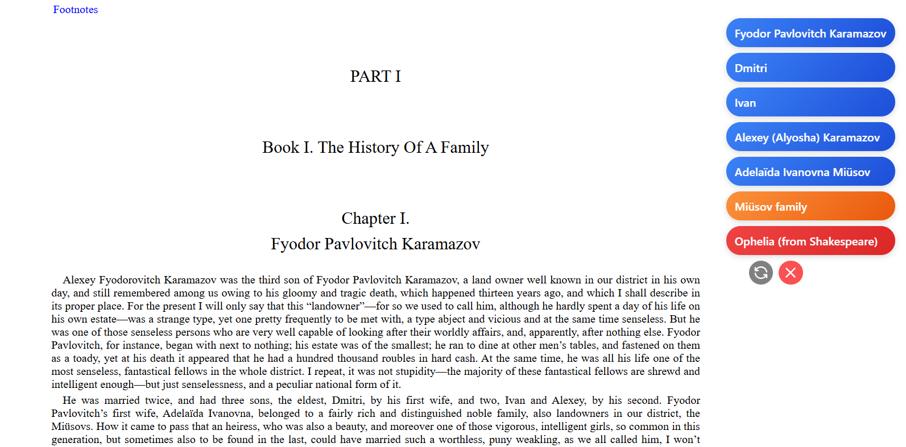
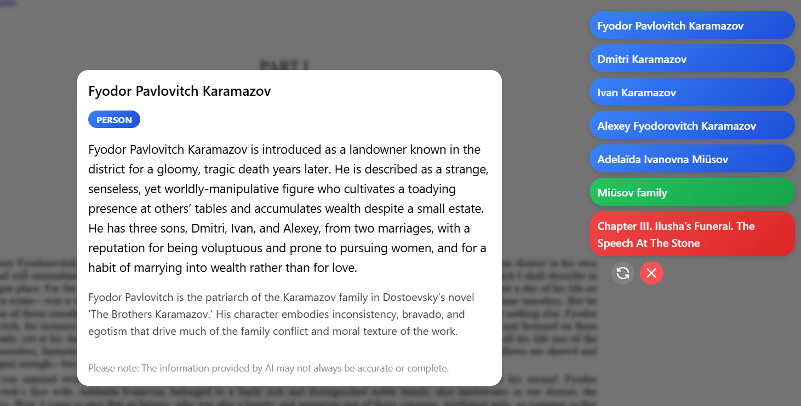

# Bubblener

Bubblener is a browser extension that leverages LLMs to perform Named-Entity Recognition (NER) on any webpage. It identifies key entities like people, organizations, locations, and concepts, presenting them as interactive, color-coded "bubbles" for easy exploration and contextual understanding.




Built with React + WXT + Mantine.

[](https://opensource.org/licenses/MIT)

## Features

-   **Dynamic Entity Recognition**: Analyzes the visible text on a webpage to identify key entities.
-   **Interactive Bubbles**: Displays extracted entities as floating bubbles in a configurable position on the screen.
-   **Rich Context**: Hover over a bubble for a quick description. Click to open a detailed modal with a summary synthesized from the text and contextual enrichment from the AI's general knowledge.
-   **Automatic Updates**: Bubbles automatically refresh when you scroll significantly down the page, analyzing new content as it becomes visible.
-   **On-Demand Activation**: Activate the extension on any page using the right-click context menu.
-   **Highly Customizable**: Use the extension popup to configure your API key, customize bubble colors, positioning, the maximum number of entities, and more.
-   **ChatGPT, Gemini, Deepseek**: Use any one of your favorite LLMs, without paying any middle party, using your own API token.

## How It Works

1.  When activated on a page, a content script is injected.
2.  The script extracts the visible text content from the page's HTML, prioritizing main content elements like `<article>` or `<main>`.
3.  This text is sent to the background script.
4.  The background script sends the text to the selected API with a structured prompt requesting the extraction of key entities, descriptions, and summaries.
5.  The returned JSON data is parsed and sent back to the content script.
6.  A React application renders the entities as interactive bubbles on the webpage's UI layer, allowing the user to explore the identified concepts.


### Installation & Setup

1.  **Clone the repository:**
    ```bash
    git clone https://github.com/antoni4040/Bubblener.git
    cd Bubblener
    ```

2.  **Install dependencies:**
    ```bash
    npm install
    ```

3.  **Build the extension:**
    ```bash
    # For Chrome, Edge, etc.
    npm run build

    # For Firefox
    npm run build:firefox
    ```
    This will create a `dist/` (or `dist-firefox/`) directory containing the unpacked extension files.

4.  **Load the extension in your browser:**
    -   **Chrome/Edge**:
        -   Go to `chrome://extensions` or `edge://extensions`.
        -   Enable "Developer mode".
        -   Click "Load unpacked" and select the `dist` folder.
    -   **Firefox**:
        -   Go to `about:debugging#/runtime/this-firefox`.
        -   Click "Load Temporary Add-on...".
        -   Select any file inside the `dist-firefox` folder.

5.  **Configure the API Key:**
    -   Click the Bubblener icon in your browser's toolbar to open the settings popup.
    -   Enter your API key for your selected service and click "Save Settings".
