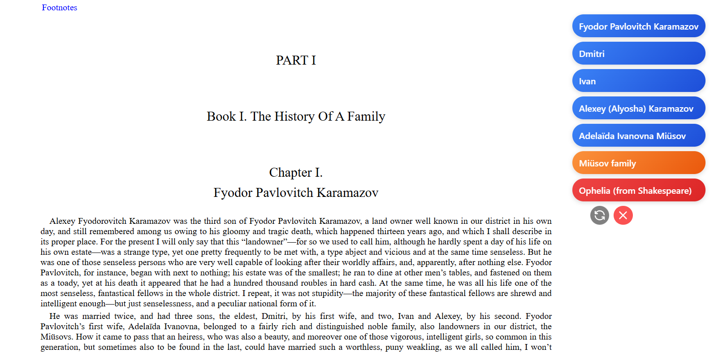
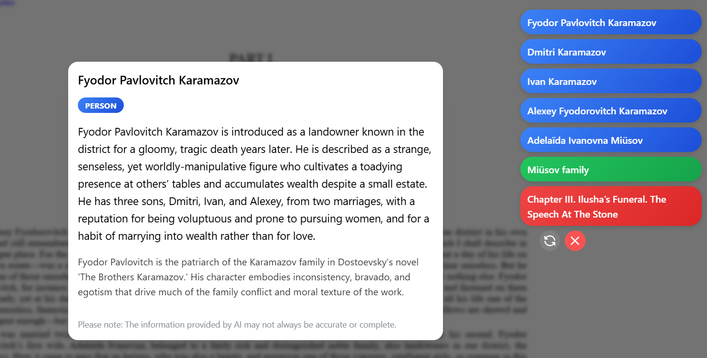

# Bubblener

Bubblener is a browser extension that leverages LLMs to perform Named-Entity Recognition (NER) on any webpage. It identifies key entities like people, organizations, locations, and concepts, presenting them as interactive, color-coded "bubbles" — and anchors each one back to where it actually appears in the text.




Built with React + WXT + Mantine.

[](https://opensource.org/licenses/MIT)

## Features

### Reading
-   **Anchored to the text**: every mention is quietly underlined where it occurs. Hover a bubble to box its mentions and draw a line to each; hover a mention to light up its bubble. Mentions below the fold get a line running off the edge toward them.
-   **Follows what you're reading**: only the text currently on screen is analysed, so scrolling through a long article surfaces the entities of the section in front of you rather than re-reading the top of the page.
-   **Entities accumulate**: results stream in and are added as they arrive, rather than the whole set being replaced at once. Entities you've scrolled far past are retired automatically.
-   **Ranked, not truncated**: the model scores how central each entity is to the passage, and the least important lose their place first when you're at your bubble limit.
-   **Star and hide**: pin an entity to keep it regardless of limits and distance, or hide one for good. Both lists are browsable in a separate Library page.
-   **Rich context**: hover a bubble for a quick description; click for a summary drawn from the text plus background from the model's own knowledge.

### Setup and control
-   **Four providers**: Gemini, ChatGPT, DeepSeek — using your own API key, with no middle party — or **Ollama**, running locally with no key and no network at all.
-   **Low / High quality tiers**: pick a cheap fast model or a stronger one per provider. The popup always shows exactly which model ID that resolves to.
-   **Token usage**: input/output counts on the page as you read, plus an all-time total in the popup.
-   **Four themes**: Light, Dark, Library and Cyberpunk. They change shape and typography, not just color — Library is square-cornered small-caps Baskerville on parchment, Cyberpunk is a phosphor terminal.
-   **Three ways to start**: the small launcher button on the page, "Analyse this page" in the popup, or the right-click menu.
-   **Highly customizable**: bubble colors per entity type, position, distance, size, fade-when-idle, highlight toggle, entity limit, and how far you scroll before re-analysing.

## How It Works

1.  Nothing happens until you start it — via the on-page launcher, the popup button, or the right-click menu. A content script is then injected into that tab.
2.  The script reads the text **currently on screen**, within the page's main content container (`<article>`, `<main>`, and similar) so navigation and sidebars are left out.
3.  That text goes to the background script — the only place that ever holds your API key.
4.  The background script calls your chosen provider with a prompt that asks for entities **actually present in the passage**, the exact surface forms they appear under, and an importance score.
5.  The response is streamed: entities are parsed out of the partial answer and appear as they arrive.
6.  Each entity's surface forms are located in the page, and the bubbles, mention marks and connector lines are rendered in a shadow-root React app over the page.

Scrolling repeats this for the new section. An analysis you've scrolled away from is cancelled rather than left to finish, so it neither spends tokens nor delivers entities for a passage you've left.

## Privacy

-   **No backend.** Your text goes from your browser straight to the provider you chose. There is no server in between, and nothing is collected.
-   **Your key stays local.** It is stored with `storage.local` (never `sync:`, so it is not uploaded to a browser account) and is only ever read by the background script. The settings UI can't display it back to you — once saved, it shows "Key saved" and a *Change Key* button. Note that `storage.local` is plaintext on disk: anything with access to your browser profile can read it. Browser extensions have no access to OS keychains.
-   **Ollama sends nothing anywhere.** It runs on your own machine.
-   **The launcher runs on every page.** To offer the small start button, a tiny content script (~22KB, no page content read) loads on the pages you visit. It only draws a button and reads your settings — no text is extracted and nothing is sent until you click it. You can turn it off in the popup, and the extension will still be reachable from the popup and right-click menu.
-   **Page text is sent only when you ask.** Analysis is per-tab and opt-in; a page cannot trigger it on its own.
-   **Blocked sites are never read.** Add a site under Privacy in the popup — or hit "Never on this site" — and Bubblener will not analyse it or show a launch button there. Blocking a domain covers its subdomains, and the refusal lives in the background script, so it holds even for a tab that was already active.

## Installation & Setup

1.  **Clone the repository:**
    ```bash
    git clone https://github.com/antoni4040/Bubblener.git
    cd Bubblener
    ```

2.  **Install dependencies:**
    ```bash
    npm install
    ```

3.  **Build the extension:**
    ```bash
    # For Chrome, Edge, etc.
    npm run build

    # For Firefox
    npm run build:firefox
    ```
    This creates `.output/chrome-mv3/` (or `.output/firefox-mv2/`) containing the unpacked extension.

4.  **Load the extension in your browser:**
    -   **Chrome/Edge**:
        -   Go to `chrome://extensions` or `edge://extensions`.
        -   Enable "Developer mode".
        -   Click "Load unpacked" and select the `.output/chrome-mv3` folder.
    -   **Firefox**:
        -   Go to `about:debugging#/runtime/this-firefox`.
        -   Click "Load Temporary Add-on...".
        -   Select any file inside the `.output/firefox-mv2` folder.

5.  **Choose a provider and add a key:**
    -   Click the Bubblener icon in your toolbar to open the settings popup.
    -   Pick your provider, paste your API key, and click "Save Settings".
    -   For **Ollama**, no key is needed — just select it, make sure `ollama serve` is running, and name a model you have pulled. You may need to allow the extension's origin:
        ```bash
        OLLAMA_ORIGINS='chrome-extension://*' ollama serve
        ```

6.  **Read something.** Click the small button in the corner of the page, or "Analyse this page" in the popup.

## Development

```bash
npm run dev              # Chrome dev build with auto-reload
npm run dev:firefox

npm run compile          # tsc --noEmit
npm test                 # unit suite (Vitest)
npm run test:e2e         # Playwright, real Chrome with the extension loaded
npm run test:live        # optional: real provider calls, needs your own keys
```

`npm test` and `npm run test:e2e` never touch the network — the provider SDKs are mocked and the endpoints intercepted, so the suite costs nothing. `npm run test:live` is the deliberate exception: copy `.env.example` to `.env.local`, fill in whichever provider keys you want, and it exercises the real APIs. Each provider skips itself if its key is absent, so one key is enough. See `CLAUDE.md` for details.
